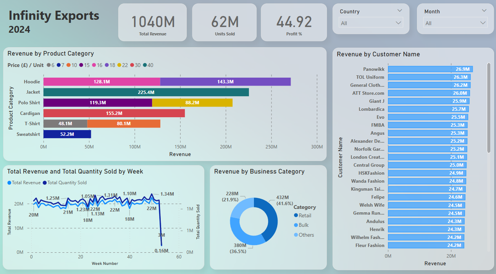

# Infinity Exports Performance Summary 2024 - An Exploratory Guide

## **1. Introduction**
This Power BI dashboard provides a comprehensive analysis of Infinity Exports' financial performance in 2024. Interactive visuals allow stakeholders to explore revenue trends, customer performance, product strengths, delivery strategies, and business categories. It offers a strategic overview of sales activity and profitability for informed decision-making.

**Why This Dashboard is Useful**
- **Revenue and Profit Tracking**: Instant visibility into key metrics such as total revenue (£1.04B), total units sold (62.23M), and average profit margin (44.92%).
- **Trend Analysis**: Weekly sales line chart shows fluctuations in both revenue and quantity sold over time, including demand spikes and downturns.
- **Product Performance**: Revenue by Product Category highlights top-earning product types and pricing distribution.
- **Customer Insights**: A breakdown of revenue by Customer Name helps identify major contributors and strategic accounts.
- **Business Category Breakdown**: Segmentation into Retail, Bulk, and Others reveals revenue share and profitability by sales model.
- **Delivery Mode Impact**: Delivery Mode chart (Air, Land, Sea) shows revenue distribution across logistics strategies.

**How to Use This Dashboard for Decision-Making**
1. Use the **Country Filter** to evaluate market performance across geographies.
2. Explore **Product Category** filters to analyse demand and pricing trends.
3. Leverage **Customer View** to assess top-performing clients for retention and upsell strategies.
4. Analyse the **Weekly Sales Chart** for planning inventory and campaign timing.
5. Review **Delivery Mode Distribution** to support logistics cost control and sustainability.
6. Use **Business Category Segmentation** to tailor pricing and volume strategies.

## **2. Dataset and Key Measures Used**
The dashboard integrates transactional, customer, and logistics data to track performance and drive insights.

**Datasets Used**
- **Transactions**: Order-level data including quantity, revenue, and product price
- **Products**: Cost, category, and unit-level pricing details
- **Customers**: Revenue by client, business category (Retail, Bulk, Others)
- **Logistics**: Shipment modes (Air, Land, Sea)

**Key Measures in Power BI**
- **Percenatage(%) of Total Revenue**: Determines each country’s share of total global revenue
- **Quantity Percentage(%) of Product Category**: Calculates what portion of total units sold is attributed to each product category
- **Revenue Percentage(%) of Product Category**: Measures each product category's contribution to total revenue
- **Profit Percentage(%)**: Calculates net profit as a percentage of revenue
-  **Product Profit**: Determines the per-unit profit for each transaction
- **Total Profit**: Aggregates total profit across all products and transactions
- **Total Revenue**: Calculates the gross revenue from all product sales
- **Week Number**: Extracts the week number from each transaction date for time-series analysis

## **3. Key Insights and Business Implications**

### **A. Sales & Profit Trends Across 2024**

**Findings**:
- Total Revenue: £1.04B
- Total Units Sold: 62.23M
- Profit Margin: 44.92%
- Highest weekly revenue reached ~£22M; sharp dip to £3M and £0.16M toward year-end (potential data cutoff or operational gap).

**Business Implications**:
- The year-end drop requires investigation — potentially a data lag, shipping constraints, or seasonal slowdown
- Strong mid-year performance indicates ideal periods for campaigns and stocking

**How the Dashboard Helps**:
- Weekly chart enables visibility into sales cycles and anomalies.
- Stakeholders can correlate the quantity sold and revenue to optimise the supply-demand balance.

### **B. Product Performance: Strengths and Weaknesses**

**Findings**:
- Top categories by revenue: Jacket (£225.4M), Cardigan (£155.2M), Hoodie (£143.3M)
- Lower performers: Sweatshirt (£52.2M) and T-Shirt (£48.1M)
- Price points vary from £6 to £40 per unit

**Business Implications**:
- Strong jacket sales suggest a focus on premium outerwear; consider regional expansions or bundled winter collections.
- Underperformers may benefit from repositioning, design refresh, or targeted discounts.

**How the Dashboard Helps**:
- Dual-bar revenue chart and tooltip metrics (% revenue share, quantity sold) allow quick comparison.
- Useful for pricing reviews and SKU rationalisation.

### **C. Regional Performance and Major Clients**

**Findings**:
- Leading countries: UK (23.9%), Spain (9.4%), France (6.2%)
- Top clients: Panowikk (£26.9M), TOL Uniform, General Clothing, etc.
- Over 25 clients contribute between £24M–£27M each

**Business Implications**:
- Market concentration in the UK indicates a need to diversify regionally for risk balance.
- Client contributions are relatively flat at the top — a strong mid-tier client base should be cultivated further.

**How the Dashboard Helps**:
- Customer and country views highlight key accounts and regions
- Filters allow drilling into client behaviour and regional seasonality

### **D. Sales Channel & Logistics Impact**

**Findings**:
- Revenue by business category: Bulk (41.6%), Others (36.5%), Retail (21.9%).
- Delivery Mode split: Air, Land, Sea (35%), Land (30%), Air (25%), Sea (10%).

**Business Implications**:
- Heavy reliance on bulk buyers opens an opportunity for customised pricing and loyalty incentives.
- High usage of air freight (25%) impacts margins; shifting more volume to sea could improve cost efficiency.

**How the Dashboard Helps**:
- The business category pie chart clarifies where profit optimisation strategies should focus.
- Delivery Mode visual guides shipping and sustainability decisions.

### **E. Sustainability Initiative: Delivery Mode Strategy**

**Findings**:
- ~25% of revenue tied to air shipments; most expensive and highest carbon impact
- Combined air/land/sea mode is largest contributor (35%)

**Business Implications**:
- Reducing air dependency can lower costs and support green initiatives
- Must be balanced with delivery timelines and customer expectations

**How the Dashboard Helps**:
- The Delivery Mode chart enables simulation of the potential impact of shifting the logistics strategy
- Combined with Country/Product filters, users can identify which markets rely heavily on fast delivery

## **4. Final Business Recommendations**

1. **Focus on Premium Products**: Expand high-performing categories like Jackets and Hoodies.
2. **Reduce Logistics Costs**: Gradually shift air shipment volumes to sea, where feasible
3. **Diversify Regional Exposure**: Target emerging markets to reduce UK dependency
4. **Strengthen Mid-Tier Clients**: Offer loyalty incentives to grow £24M–£25M tier accounts
5. **Phase Out Underperformers**: Reassess Sweatshirt and T-shirt strategies

## **5. Next Steps**
- **Predictive Sales Forecasting**: Use Power BI trendline data to estimate 2025 monthly volumes.
- **Customer Segmentation Deep-Dive**: Use filters to cluster by revenue, retention, and geography
- **Operational Refinement**: Evaluate warehouse/delivery schedules based on weekly demand swings

## **6. Conclusion**
This Power BI dashboard provides critical insight into Infinity Exports’ performance in 2024. It empowers leaders to make data-backed decisions across product strategy, logistics, and customer engagement. With clear visibility into revenue trends and operational levers, the organisation is well-positioned to refine execution and accelerate export growth into 2025.

[here](assets/Output/1b.pdf).

