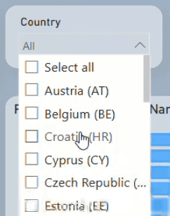

# Infinity Exports Performance Summary 2024 - An Exploratory Guide

|:--:| 
| *Dashboard Overview* |

## **1. Introduction**
This [Power BI Dashboard](assets/pbixfile/infinityexp2024.pbix) provides a comprehensive analysis of Infinity Exports' financial performance in 2024. Interactive visuals allow stakeholders to explore revenue trends, customer performance, product strengths, delivery strategies, and business categories. It offers a strategic overview of sales activity and profitability for informed decision-making.

**Why This Dashboard is Useful**
- **Revenue and Profit Tracking**: Instant visibility into key metrics such as total revenue (£1.04B), total units sold (62.23M), and average profit margin (44.92%).
- **Trend Analysis**: Weekly sales line chart shows fluctuations in both revenue and quantity sold over time, including demand spikes and downturns.
- **Product Performance**: Revenue by Product Category highlights top-earning product types and pricing distribution.
- **Customer Insights**: A breakdown of revenue by Customer Name helps identify major contributors and strategic accounts.
- **Business Category Breakdown**: Segmentation into Retail, Bulk, and Others reveals revenue share and profitability by sales model.
- **Delivery Mode Impact**: The Delivery Mode chart (Air, Land, Sea) shows revenue distribution across logistics strategies.

**How to Use This Dashboard for Decision-Making**

1. Use the **Country Filter** to evaluate market performance across geographies.

   
   |:--:| 
   | *Country Filter* |

3. Use the **Month Filter** to track monthly revenue and profit trends and identify seasonal patterns.

   
   |:--:| 
   | *Month Filter* |

5. Explore **Product Category** filters to analyse demand and pricing trends.
   
6. Leverage **Customer View** to assess top-performing clients for retention and upsell strategies.
7. Analyse the **Weekly Sales Chart** for planning inventory and campaign timing.
8. Review **Delivery Mode Distribution** to support logistics cost control and sustainability.
9. Use **Business Category Segmentation** to tailor pricing and volume strategies.
10. Analyse **Logistics Type distribution** to optimise costs and improve delivery efficiency.
11. Hover over charts to get additional information from **tooltips**. 

## **2. Dataset and Key Measures Used**
The dashboard integrates transactional, customer, and logistics data to track performance and drive insights.

**[Datasets](assets/dataset) Used**
- **[Transactions](assets/dataset/Transactions.csv)**: Contains sales data, revenue, profit, and transaction details
- **[Products](assets/dataset/Products.csv)**: Includes product pricing, costs, and categories
- **[Customers](assets/dataset/Customers.csv)**: Segments customers by name and business type (Retail, Bulk, Others)
- **[Logistics](assets/dataset/Logistics.txt)**: Tracks shipment methods (Air, Land, Sea)
- **[Salespeople](assets/dataset/Salespeople.json):** Contains demographic and background information of individual sales representatives

**Key Measures Used in Power BI**
- **Percenatage(%) of Total Revenue**: Determines each country’s share of total global revenue
- **Quantity Percentage(%) of Product Category**: Calculates what portion of total units sold is attributed to each product category
- **Revenue Percentage(%) of Product Category**: Measures each product category's contribution to total revenue
- **Profit Percentage(%)**: Calculates net profit as a percentage of revenue
-  **Product Profit**: Determines the per-unit profit for each transaction
- **Total Profit**: Aggregates total profit across all products and transactions
- **Total Revenue**: Calculates the gross revenue from all product sales
- **Week Number**: Extracts the week number from each transaction date for time-series analysis
- **Revenue Percentage(%) by Country**: Calculates each country's share of global revenue using the ratio of its sales to overall sales.

## **3. Key Insights and Business Implications**
This dashboard provides interactive and data-driven insights into Infinity Export’s financial performance. By utilising filters and dynamic visualisations, it allows stakeholders to explore revenue trends, track product performance, compare sales across regions, and evaluate the impact of logistics decisions.

The key insights below highlight how users can extract business intelligence from the dashboard and how these findings can drive strategic decisions.

### **A. Sales & Profit Trends Across 2024**

**Findings**:
- **Total Revenue**: £1.04B
- **Total Units Sold**: 62.23M
- **Profit Margin**: 44.92%
- Highest weekly revenue reached ~£22M; sharp dip to £3M and £0.16M toward year-end.

**Business Implications**:
- The February decline suggests potential seasonal effects, economic conditions, or operational inefficiencies that need further analysis.
- The August peak represents a strong sales period—this may indicate a prime time for marketing campaigns and inventory planning.
- The end-of-year drop could reflect a need for holiday promotions or customer engagement efforts to sustain revenue.

**How the Dashboard Helps**:
- The **Month Filter** allows users to analyse revenue and profit month by month, helping identify key seasonal patterns.
- The **Revenue by Week Chart** provides a detailed breakdown of fluctuations, allowing users to compare performance on a granular level.
- Users can combine filters (e.g., selecting a month + country) to explore regional differences in sales trends.

To illustrate the usage of tooltips, the United Kingdom is selected in the Country filter, and May is selected in the Month filter. 

ℹ️**ToolTip: Country-wise % Revenue Contribution**

💰 **Revenue Concentration Analysis**: Helps identify over-reliance on specific countries, allowing diversification strategies to reduce financial risk and improve revenue stability.

📈 **Market Investment Prioritisation**: Guides decisions on where to allocate marketing or expansion budgets to maximise returns from high-performing or high-potential regions.

**ToolTip Insights**
- UK Revenue Share: 23.92% of total revenue in 2024
- With total revenue at £1,040M, the UK contributes approximately £248.8M in revenue.

**Implication for Investment**: Being the top market, the UK justifies further resource investment (e.g., campaigns or infrastructure) to reinforce and grow revenue.

|:--:| 
| *ToolTip: Revenue Percentage(%) by Country* |

### **B. Product Performance: Strengths and Weaknesses**

**Findings**:
- Top categories by revenue: Jacket (£225.4M), Cardigan (£155.2M), Hoodie (£143.3M)
- Lower performers: Sweatshirt (£52.2M) and T-Shirt (£48.1M)
- Price points vary from £6 to £40 per unit

**Business Implications**:
- Sweatshirt and T-shirt sales underperformance may indicate pricing, branding, or market positioning issues. Strategies such as discounts, redesigns, or promotional bundles could improve demand.
- Jacket, Cardigan, and Hoodie sales dominance suggests potential expansion opportunities, such as introducing premium, limited-edition, or region-specific variations.

**How the Dashboard Helps**:
- The **Revenue by Product Category Chart** clearly distinguishes top-performing and underperforming products.
- By using the **Country Filter**, users can analyse how different product categories perform across regions.
- Combining **Month + Product Category** filters helps assess seasonality in product sales.

ℹ️**ToolTip: Product-Level Financial Summary**

📊 **Profitability Assessment**: Showing product-wise profit and cost helps finance teams evaluate which products are most financially viable or eroding margins.

⚖️ **Pricing and Cost Optimisation**: Enables informed decisions around pricing strategy or cost control initiatives to improve profit margins per product.

**ToolTip Insights**
- Jackets and Hoodies contribute significantly to both top-line revenue and bottom-line profit. Jackets, despite lower volume, deliver exceptional returns due to premium pricing. Hoodies provide balanced volume and profitability.
- T-shirts and Sweatshirts are low-margin, high-volume products. While they aid total unit sales, they do not contribute as efficiently to profitability.

**Investment Suggestion**
- Continue prioritising premium products like Jackets for margin maximisation, and Hoodies for volume-plus-profit stability. Ensure consistent availability and targeted marketing during peak demand
- Use T-Shirts and Sweatshirts as entry-level or promotional products to boost volume and attract new customers, but do not rely on them for driving profits. Consider bundling them with higher-margin items.

|:--:| 
| *Space* |

ℹ️**ToolTip: Product Revenue vs Quantity Table**

💡 Margin vs Volume Trade-Off: Shows whether high-volume products are generating enough revenue to justify their scale, enabling correction of financially inefficient product lines.

📦 Revenue Contribution Clarity: This section highlights which products are driving disproportionate revenue, supporting the reallocation of resources to high-yield items.

**ToolTip Insights**

- Jacket (£40) consistently leads in revenue, making it a high-value product worth sustained promotion.
- T-Shirts (£6) and PoloShirts (£15) lead in quantity sold, indicating mass appeal and potential for bundle deals or upselling.
- Hoodies maintain a stable presence in both volume and revenue, signalling a dependable mid-tier option.

|:--:| 
| *Space* |

### **C. Regional Performance and Major Clients**

**Findings**:
- Leading countries: UK (23.9%), Spain (9.4%), France (6.2%)
- Top clients: Panowikk (£26.9M), TOL Uniform, General Clothing
- Over 25 clients contribute between £24M–£27M each

**Business Implications**:
- The UK’s market dominance suggests a need to expand into emerging markets for long-term growth.
- Heavy reliance on a few key customers may pose a risk; diversifying the client base could enhance stability.
- Customer segmentation strategies, such as personalised offers or loyalty programs, could help maintain long-term client relationships.

**How the Dashboard Helps**:
- The **Revenue by Customer Chart** helps identify high-value clients.
- The **Country Filter** allows users to compare revenue distribution by region.
- The combination of **Month + Country** filters provides insights into seasonal variations in regional sales.

ℹ️**ToolTip: Salesperson Profile**

🎯 Attribution of Sales Revenue: Helps attribute revenue outcomes to specific individuals or teams, which supports performance-based incentives and territory ROI analysis.

🧭 Territory Profitability Mapping: Enables finance and sales leaders to track which territories or reps contribute most to financial goals, guiding hiring or training investments.

**ToolTip Insights**
- International sales reps are successfully building relationships and closing high-value deals in the UK. This suggests that cultural or regional background is not a barrier to high-touch B2B apparel selling.
- Salespeople with multiple UK client accounts generate higher cumulative revenue. This points to strong relationship management, possibly built on trust, retention, or deep industry knowledge.

**Implication:**
- Leverage high-performing international reps to further penetrate and expand in the UK market.
- Nurture and reward multi-client management to build stronger, revenue-rich customer relationships.

|:--:| 
| *Space* |

### **D. Sales Channel & Logistics Impact**

**Findings**:
- Revenue by business category: Bulk (41.6%), Others (36.5%), Retail (21.9%).
- Delivery Mode split: Air, Land, Sea (35%), Land (30%), Air (25%), Sea (10%).

**Business Implications**:
- Bulk sales profitability may require pricing adjustments to increase revenue from high-volume customers.
- Reducing air shipment reliance aligns with sustainability goals but requires monitoring for potential delivery delays or customer complaints.
- Cost savings from logistics changes should be reinvested in optimising supply chain efficiency.

**How the Dashboard Helps**:
- The Revenue by Business Category Chart enables comparison across retail, bulk, and other distribution channels.
- The Logistics Type Distribution tracks the impact of reducing air shipments in favour of land/sea alternatives.
- The Month Filter allows users to analyse the impact of logistics changes over time.

ℹ️**ToolTip: Revenue by Delivery Mode**

🚚 Cost-Efficiency Insights: Allows evaluation of how logistics methods align with revenue, identifying opportunities to shift toward more cost-effective delivery modes.

**ToolTip Insights**
- Customers prefer flexible or fast shipping solutions, with multi-mode logistics being the most effective in driving revenue.
- Retail partners are the most lucrative, followed closely by bulk buyers.

**Investment Suggestion**
- Prioritise flexible logistics infrastructure—particularly Air and hybrid models—to meet revenue-driving customer preferences.
- Invest more in retail channel strategies, which show higher spending and responsiveness to delivery efficiency.

|:--:| 
| *Space* |

### **E. Sustainability Initiative: Potential Impact of Reducing Air Shipments**
As part of a potential sustainability initiative, Infinity Export could consider reducing its reliance on air transport to minimise environmental impact and reduce logistics costs. The dashboard allows us to evaluate the financial impact of such a decision by analysing the revenue generated through air shipments.

**Key Assumptions**
- If Universal Export were to phase out air shipments entirely, it would impact a significant portion of total revenue.
- Air shipments account for approximately 30.18% of total logistics, meaning that a land and sea transport transition could require operational adjustments.
- Revenue dependence on air shipments (~$314M) suggests that certain product categories or customer segments might be affected disproportionately if a logistics shift is implemented.

**Projected Business Implications**
- Revenue at Risk: If all air shipments were eliminated, approximately $314M in revenue could be affected, requiring alternative logistics solutions to maintain supply chain efficiency.
- Delivery Delays: Switching from air to land/sea logistics may increase delivery times, potentially affecting customer satisfaction and order fulfilment speed.
- Cost Savings: While reducing air shipments could lower logistics costs, it would require an evaluation of whether slower transportation methods impact order volume and repeat purchases.
- Product & Market Impact: Certain high-demand, time-sensitive products (such as seasonal or promotional items) may need to remain on air transport to avoid stockout risks.

**How the Dashboard Helps Analyse This Scenario**
- The Revenue by Business Category chart allows users to explore how much revenue is currently dependent on air transport.
- By applying the Product Category filter, users can identify which products would be most impacted by a reduction in air shipments.
- The Country Filter helps analyse if certain markets rely more heavily on air shipments than others, enabling strategic adjustments in logistics planning.

This dashboard provides a framework for evaluating the feasibility of a sustainability-driven logistics shift, enabling Universal Export to assess potential trade-offs between cost savings, revenue impact, and customer service levels.

## **4. Final Business Recommendations**
- **Phase Out Underperformers**: Reassess marketing, pricing, and design for low-margin products like Sweatshirts and T-Shirts.
- **Diversify Regional Exposure**: Expand beyond the UK to reduce overdependence on a single market.
- **Monitor Logistics Impact**: Ensure shifting away from air shipments doesn’t degrade customer experience.
- **Strengthen Sales Channel Profitability**: Restructure bulk pricing models to boost margin efficiency.
- **Optimise Underperforming Products**: Streamline offerings and reinvest in higher-performing alternatives.

## **5. Next Steps**
- **Sales Forecasting**: Use predictive analytics to estimate 2025 sales trends.
- **Customer Segmentation Analysis**: Identify high-value customers and retention strategies.
- **Supply Chain Optimisation**: Evaluate how alternative shipping methods impact delivery efficiency and revenue

## **6. Conclusion**
This Power BI dashboard provides critical insight into Infinity Exports’ performance in 2024. It empowers leaders to make data-backed decisions across product strategy, logistics, and customer engagement. With clear visibility into revenue trends and operational levers, the organisation is well-positioned to refine execution and accelerate export growth into 2025.

